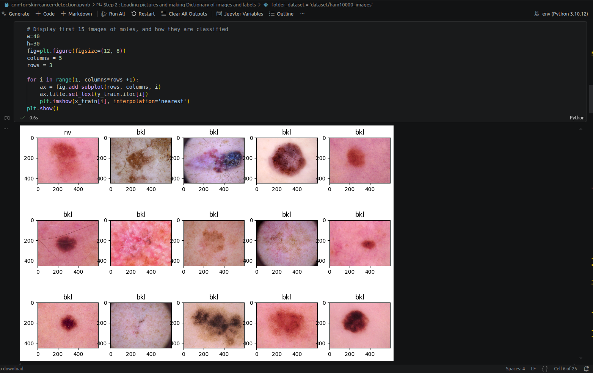
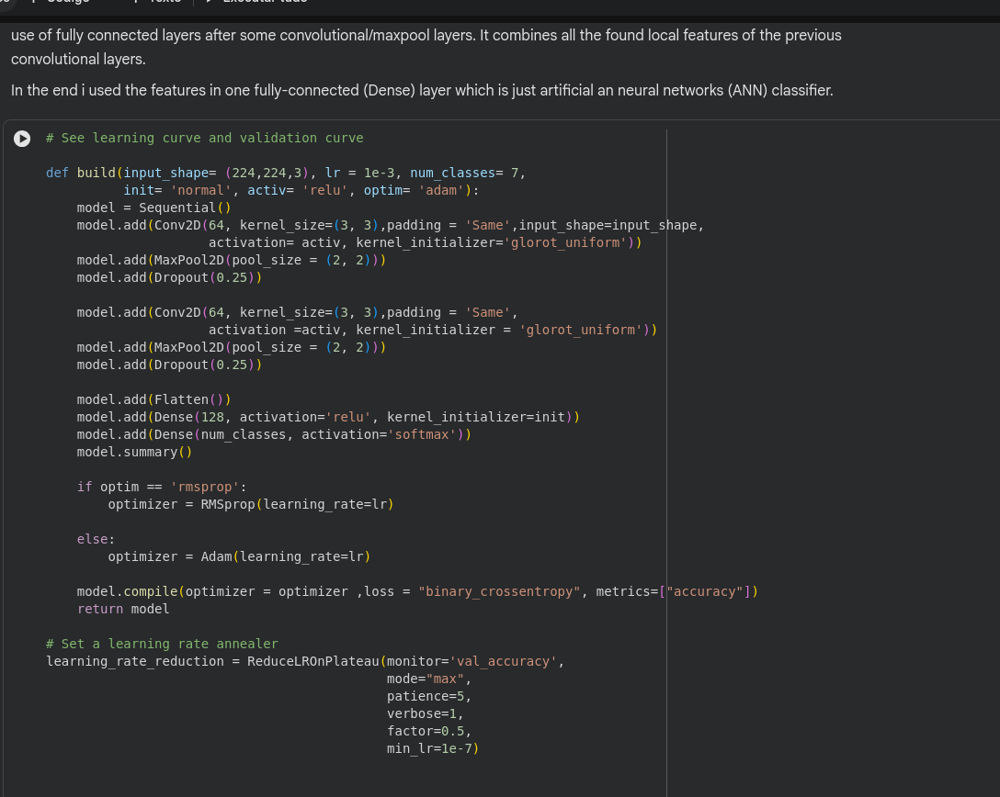
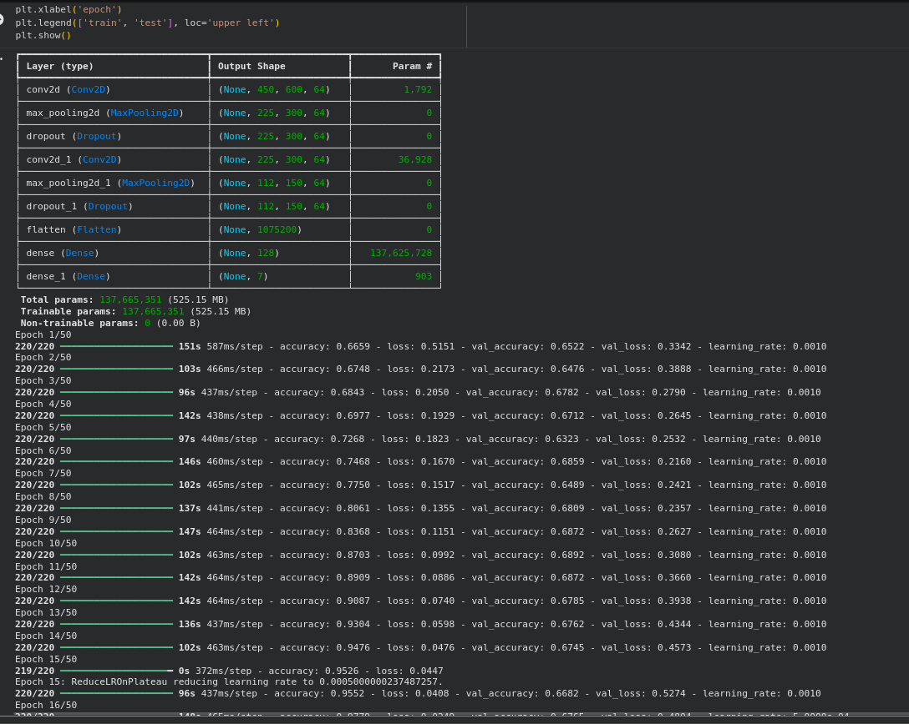

# Computer Vision Project <!-- omit in toc -->

**[Github Repository](https://github.com/YamanduGermano/computer-vision-project/tree/main)**

## Summary <!-- omit in toc -->

- [Project objective:](#project-objective)
- [Calendar](#calendar)
- [Sprints](#sprints)
  - [Sprint #1](#sprint-1)
  - [Sprint #2](#sprint-2)
  - [Sprint #3](#sprint-3)


## Project objective:

```
How to improve skin-disease detection in dark skin-tones using CNNs.
```

## Calendar

| Date  | Name      | Objective                                                                                  |
| ----- | --------- | ------------------------------------------------------------------------------------------ |
| 07/04 | Sprint #1 | Basic project structure and setting up the database. First tests with simple detection CNN |
| 14/04 | Sprint #2 | Implementing segmentation to improve classification performance                            |
| 28/04 | Sprint #3 | Creating web interface to use with the model                                               |
| 05/05 | Sprint #4 | Connecting web interface with the model and polishing last details                         |
|       |           |                                                                                            |
| 12/05 | Sprint #5 | Polishing phase                                                                            |


## Sprints

### Sprint #1

**Resources needed:** AWS resources to host the model backend.

### Sprint #2

The model couldn't be trained on a personal notebook with 16 GB of ram. The estimated size required to train the entire database of images is around 40 GB.
A smaller version was tested with a total of 500 input images and it required 8 GB to be loaded.

More work will be necessary in the following week in order to get the model working.

 

 


### Sprint #3

A simple CNN classification model was able to achieve about .7 accuracy in the test dataset.

 


A RESNET50 implementation would increase this accuracy although requiring more resources for training (about 13GB of VRAM were required to train this CNN using a T4 inside a Google Colab environment using the Torch's `DataLoader`).

**Next steps**: Train a RESNET50 with the dataset and implement segmentation method to separate the skin from the lesion itself. Then ship it to a AWS server and build a front-end to use the service.